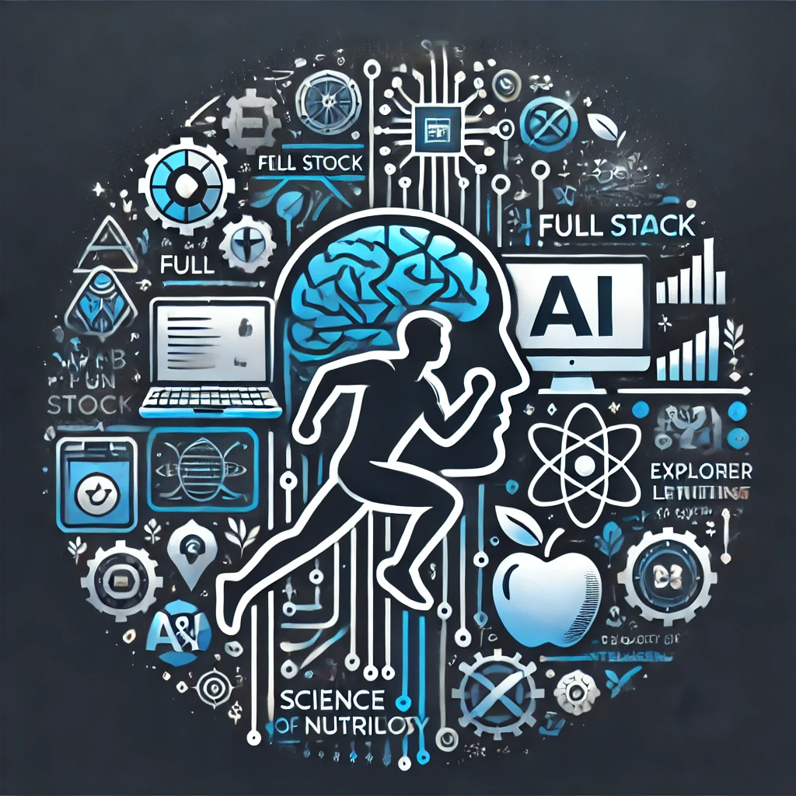

<figure>
     
</figure>

# 🌱 Hello! I'm Jesús Vega 👋 
### Aspiring developer, passionate about sports, healthy living, and artificial intelligence. I’m driven to build applications and websites that contribute to both the tech world and a balanced, sustainable lifestyle.

-  **💻 Full Stack | Training in web and application development, creating intuitive and efficient solutions.**

-  **🤖 AI Explorer | Diving into artificial intelligence to apply machine learning to impactful projects.**

-  **🍎 Science & Nutrition | Interested in how nutrition and technology enhance well-being.**

-  **🏃‍♂️ Sports Enthusiast | Sports are essential in my life; I believe in a balanced mind and body.**

-  **🌍 Nature Lover | I enjoy connecting with nature to disconnect and recharge.**

### Always seeking challenges that drive my growth. Let’s build a healthier, tech-driven world together! 🚀

 

## Technologies Used 🛠️

           

                                                                 
                                                                           
                     

 
 
 

 

## Contact Me 📫

If you have any questions, suggestions, or simply want to chat about web development or healthy eating, feel free to contact me through:

 

 

I hope you enjoy exploring my repository! Thanks for visiting! 👋

------

# 🌱 ¡Hola! Soy Jesús Vega 👋
<figure>
     
</figure>
### Desarrollador en formación, amante del deporte, la vida saludable y la inteligencia artificial. Me apasiona construir aplicaciones y sitios web que aporten tanto al mundo tech como a un estilo de vida equilibrado y sostenible.

-  **💻 Full Stack | Formándome en desarrollo web y aplicaciones, creando soluciones intuitivas y eficientes.**

-  **🤖 Explorador de IA | Profundizando en inteligencia artificial para aplicar machine learning a proyectos con impacto.**

-  **🍎 Ciencia y alimentación | Interesado en cómo la nutrición y la tecnología mejoran el bienestar.**

-  **🏃‍♂️ Entusiasta del deporte | El deporte es esencial en mi vida; creo en el equilibrio cuerpo-mente.**

-  **🌍 Amante de la naturaleza | Disfruto de la conexión con la naturaleza para desconectar y recargar.**

### Siempre en busca de retos que me impulsen a crecer. ¡Construyamos juntos un mundo más saludable y tech! 🚀

 

## Tecnologías utilizadas 🛠️

           

                                                                 
                                                                           
                     

 
 
 

 

## Contáctame 📫

Si tienes preguntas, sugerencias o simplemente quieres charlar sobre desarrollo web o alimentación saludable, no dudes en ponerte en contacto conmigo a través de:

 

 

 

¡Espero que disfrutes explorando mi repositorio! ¡Gracias por visitar! 👋
